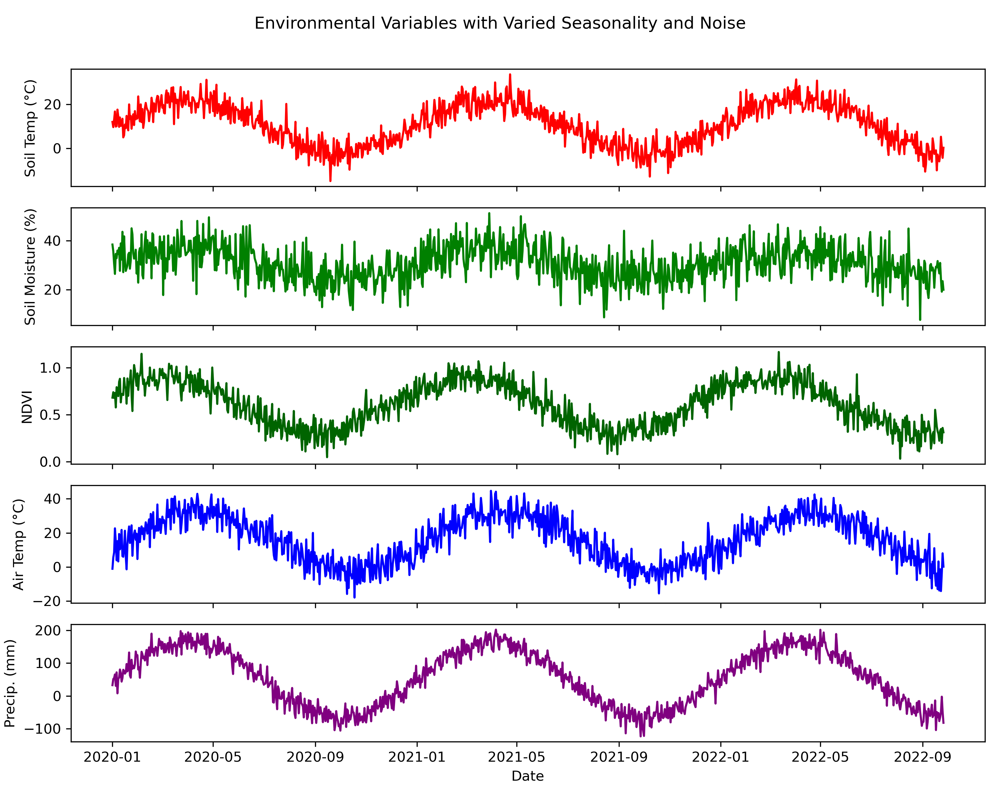
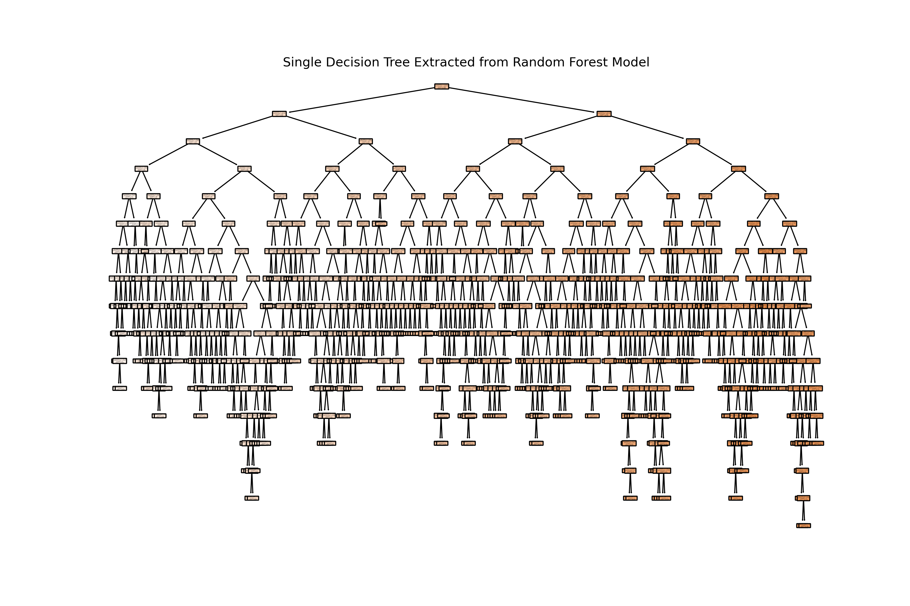
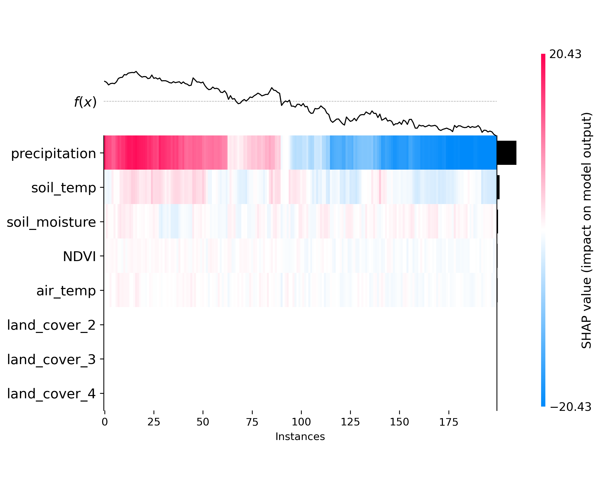
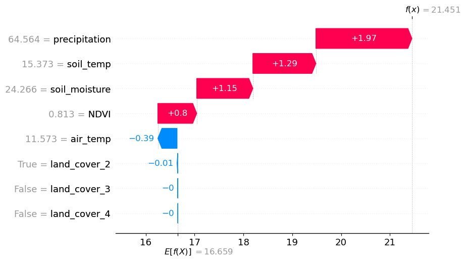

# 🌍 GHG Flux Modeling with Random Forests

This repository simulates and models greenhouse gas (GHG) flux data using synthetic environmental variables. It includes tools for modeling, imputing missing data, evaluating model performance, aligning predictors using cross-correlation, and interpreting predictions using SHAP values.

---

## 📁 Contents
- `GHG_fluxes_RF.ipynb` or script file with the complete workflow
- `GHG_fluxes_RF.py` or script file with the complete workflow
- `README.md` – Project description and workflow

---

## 🚀 Features
- ✅ Generate synthetic seasonal environmental data
- ✅ Simulate GHG fluxes with noise and nonlinearity
- ✅ Impute missing GHG flux values using Random Forest
- ✅ Train & tune models via `GridSearchCV`
- ✅ Visualize predictions with uncertainty (tree-level std. dev.)
- ✅ Interpret model using SHAP (summary, dependence, force, waterfall, heatmap, beeswarm)
- ✅ Perform cross-correlation analysis to identify optimal predictor lags
- ✅ Construct lag-optimized dataset and correlation matrix
- ✅ Visualize environmental variables with seasonal variation and lags

---

## 🛠️ Requirements
Install required libraries:
```bash
pip install numpy pandas matplotlib scikit-learn shap
```

---

## 🧪 Workflow Overview

### 🔹 Data Simulation
- Synthetic dataset over 1000 days with realistic seasonal cycles
- Variables include:
  - Soil Temperature
  - Soil Moisture
  - NDVI
  - Air Temperature
  - Precipitation
  - Land Cover (categorical)
- GHG flux computed as a weighted, noisy function of these variables

### 🔹 Missing Data & Imputation
- 20% of GHG flux values are removed randomly
- Random Forest trained on complete data to impute missing values
- Imputed values are validated using:
  - MAE, RMSE, R²
  - Scatter plot with RMSE error bars
  - Time series visualization with predicted gaps and uncertainty ribbons

### 🔹 Model Training & Evaluation
- `RandomForestRegressor` optimized with `GridSearchCV`
- Evaluation metrics on test data:
  - MAE, RMSE, R²
- Per-tree ensemble prediction uncertainty visualized via error bars

### 🔹 SHAP-Based Interpretability
- Summary plots (bar, beeswarm)
- Dependence plots for individual features
- Force plots for local instance explanations (exported as HTML)
- Waterfall plots for detailed prediction breakdowns
- Heatmap of SHAP values for all samples

### 🔹 Temporal Analysis with Cross-Correlation
- Each predictor analyzed with respect to GHG flux using `scipy.signal.correlate`
- Optimal lag for maximum cross-correlation identified
- Predictors realigned by their optimal lag
- Correlation matrix computed on lag-optimized dataset
- Visualizations include:
  - CCF plots for each feature
  - Lagged correlation matrix
  - Multi-panel time series of aligned variables

### 🔹 Applying Cross-Correlation to Real Data

Now that the full cross-correlation workflow has been demonstrated on synthetic data, you can begin experimenting with your real-world environmental variables. This method allows you to:

- Quantify the temporal relationship between predictors (e.g., temperature, moisture, NDVI) and your target variable (e.g., GHG fluxes).
- Identify the optimal lag at which each predictor is most strongly correlated with GHG flux.
- Create a lag-optimized dataset, where each variable is realigned based on its most predictive temporal offset.

This approach is especially valuable when modeling ecosystem processes that are influenced by delayed environmental responses (e.g., soil respiration reacting to prior rainfall or vegetation greenness with a lag).

---

## 📊 Example Visuals

### GHG Flux Time Series


### Random Forest Tree


### SHAP Force Plots


### SHAP Heatmap


### SHAP Waterfall Plot



---

## 📌 Notes
- Fully synthetic data makes this ideal for experimentation and reproducibility
- Can be adapted for real-world sensor or remote sensing datasets
- SHAP plots require notebook environment with JavaScript enabled

---

## 👨‍💻 Author
Created by Gyula Mate Kovacs · Powered by Python

---

## 📄 License
MIT License
